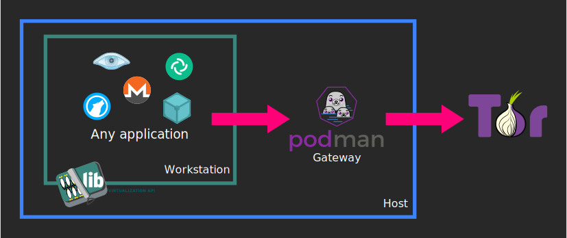

# TorVirt
[Whonix](https://www.whonix.org)-like setup with a [libvirt](https://libvirt.org) workstation and a [podman](https://podman.io) container as the [Tor](https://torproject.org) gateway.



## What are the advantage of this project over original Whonix ?
Whonix uses one VM for the workstation and another VM for the Tor gateway. This can be costly in terms of performance and resource usage. TorVirt improves on this by running the gateway in a lightweight container instead of a full VM.

## Is it as secure as Whonix ?
Containers share the same kernel as the host. This means that if someone manages to exploit a bug in software present in the container (such as the tor daemon) and then uses a vulnerability in the kernel, they could gain access to the host's operating system. To mitigate this risk, some measures have been put in place:
- The gateway container is created using podman in rootless mode
- The container runs with all capabilities dropped (`--cap-drop=ALL`)
- Container processes cannot gain additional privileges (`--security-opt=no-new-privileges`)
- The entry point is executed with normal user privileges

# Use it !

Install dependencies (debian-based):
```
sudo apt-get install libvirt-daemon libvirt-clients podman bridge-utils
```

## Download
```
git clone --depth=1 https://forge.chapril.org/hardcoresushi/TorVirt.git
```
All commits should be signed with my OpenPGP key available on keyservers. You can import it like this:
```
gpg --keyserver hkps://keyserver.ubuntu.com --recv-keys AFE384344A45E13A
```
Fingerprint: `B64E FE86 CEE1 D054 F082  1711 AFE3 8434 4A45 E13A` \
Email: `Hardcore Sushi <hardcore.sushi@disroot.org>`

Once imported, verify the latest commit:
```
cd TorVirt
git verify-commit HEAD
```
This must show you something like:
```
gpg: Signature made <date> CET
gpg:                using RSA key B64EFE86CEE1D054F0821711AFE384344A45E13A
gpg: Good signature from "Hardcore Sushi <hardcore.sushi@disroot.org>" [unknown]
gpg: WARNING: This key is not certified with a trusted signature!
gpg:          There is no indication that the signature belongs to the owner.
Primary key fingerprint: B64E FE86 CEE1 D054 F082  1711 AFE3 8434 4A45 E13A
```
**Do not continue if the verification fails !**

## Setup
```
./torvirt configure
```

## Create the workstation
You can create the workstation VM any way you like, with any OS, but you must select *torvirt* as the network. You can use [virt-manager](https://virt-manager.org) GUI to do it easily.

Make sure that *torvirt* is the only network configured for the VM, otherwise leaks may occur.

## Start
Start the gateway:
```
./torvirt start
```

Start the workstation !
