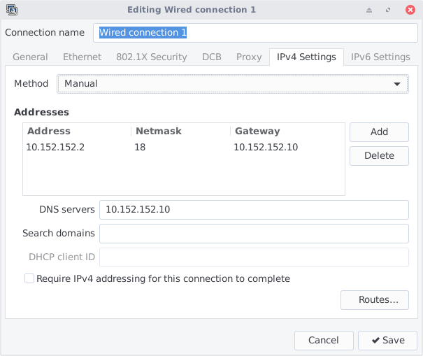

# Hide My Pussy !
Whonix setup with KVM as workstation and a docker container as gateway.


## What is Whonix ?
[Whonix](https://www.whonix.org) is a secure anonymization tool that creates a virtual machine in which all internet traffic is routed through [Tor](https://www.torproject.org/) via another virtual machine. These two VMs are connected in an internal virtual network. The only way for the workstation to access the Internet is to use the gateway, and thus anonymizing the network traffic. This allows you to run all kind of applications without worrying of IP leaks.

## What are the advatage of this project over original Whonix ?
Whonix uses one VM for the workstation and another VM for the tor gateway. If you don't have enough RAM, this may be resource expensive. With Hide my Pussy, you can improve the workstation performances by running the gateway inside a docker container instead of a full VM.

## Is it as secure as Whonix ?
Docker containers share the same kernel as the host. This means that if someone manages to exploit a software in the gateway container (such as the tor daemon) and then exploits a vulnerability in the kernel, he could gain access to the host's operating system. To mitigate this risk, the gateway container is started with `--cap-drop=ALL` and the only additional software installed is the tor daemon, which runs under normal user privileges.

# Use it !

Install dependencies (debian-based):
```
sudo apt-get install virt-manager docker.io
```

Clone the repo:
```
git clone --depth=1 https://forge.chapril.org/hardcoresushi/hidemypussy.git
```
All commits should be signed with my OpenPGP key available on keyservers. You can import it like this:
```
gpg --keyserver hkp://pool.sks-keyservers.net --recv-keys 007F84120107191E
```
Fingerprint: `BD56 2147 9E7B 74D3 6A40  5BE8 007F 8412 0107 191E` \
Email: `Hardcore Sushi <hardcore.sushi@disroot.org>`

Once imported, verify the latest commit:
```
cd hidemypussy
git verify-commit HEAD
```
This should show you something like:
```
gpg: Signature made <date> CET
gpg:                using RSA key BD5621479E7B74D36A405BE8007F84120107191E
gpg: Good signature from "Hardcore Sushi <hardcore.sushi@disroot.org>" [unknown]
gpg: WARNING: This key is not certified with a trusted signature!
gpg:          There is no indication that the signature belongs to the owner.
Primary key fingerprint: BD56 2147 9E7B 74D3 6A40  5BE8 007F 8412 0107 191E
```
__Don't continue if the verification fails !__

Configure your host:
```
sudo ./hidemypussy.sh configure
```

## Create the workstation
_In this tutorial, we will use the Kicksecure VM from the Whonix project. However, it's not strictly needed. You can use any other VM instead. For that, just configure your custom VM to use the network "hidemypussy"._

Download the Kicksecure VM from https://www.whonix.org/wiki/Kicksecure/KVM. Don't forget to __verify OpenPGP signatures__ ! \
Then, extract the downloaded archive:
```
tar -xvf Kicksecure*.libvirt.xz
```
Move the workstation image to the libvirt's images folder:
```
sudo mv Kicksecure*.qcow2 /var/lib/libvirt/images/Kicksecure.qcow2
```
Edit the workstation XML file to use the hidemypussy network:
```
sed "s/network='default'/network='hidemypussy'/g" Kicksecure*.xml > Kicksecure-hidemypussy.xml
```
Import the workstation VM:
```
sudo virsh define Kicksecure-hidemypussy.xml
```

## Start the gateway
```
sudo ./hidemypussy.sh start
```

## Start the workstation
The easiest way to start the workstation is through the `virt-manager` GUI. \
Once started, you will need to configure the VM to use the tor gateway as default gateway and default DNS server. The default IP for the gateway is `10.152.152.10`. You can get it by running `sudo docker exec hidemypussy ifconfig vmnet-cont | awk '/inet addr/{print substr($2,6)}'`. \
Inside the workstation, run:
```
sudo echo "nameserver 10.152.152.10" > /etc/resolv.conf
sudo ip route add default via 10.152.152.10
```
To make this changes persistent, you can make a script that runs these 2 commands at startup or manually configure the interface in Network-Manager:


